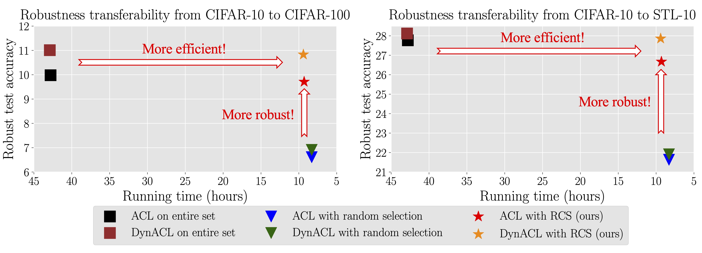

# Efficient Adversarial Contrastive Learning via Robustness-aware Coreset Selection 
---
This repository provides codes for NeurIPS 2023 (Spotlight) paper: **Efficient Adversarial Contrastive Learning via Robustness-aware Coreset Selection** (https://arxiv.org/pdf/2302.03857.pdf) 
<br>Xilie Xu* (NUS), Jingfeng Zhang* (RIKEN-AIP/The University of Auckland), Feng Liu (The University of Melbourne), Masashi Sugiyama (RIKEN-AIP/The University of Toyko), Mohan Kankanhalli (NUS).

<!-- In this repo, we provide the code and the script for reproducing the experiments in the main paper, including ACL/DynACL on CIFAR-10/CIFAR-100/STL10, ACL on ImageNet-1K, and standard adversarial training (SAT) on ImageNet-1K.  -->

<div align="center">
    
</div>

<br>

**Robustness-aware coreset selection (RCS)** can significantly **speed up** both robust self-supervised pre-training and supervised pre-training while **maintaining** the transferability of the pre-trained models. 

RCS outputs a coreset which is **an informative training subset**. The model can achieve the minimized representational divergence between natural data and their adversarial counterparts after training on the coreset selected by RCS. In this way, RCS helps maintain the adversarial robustness of representations while accelerating robust pre-training. 


## Script

In our repo, we provide the codes and scripts of RCS for efficient robust pre-training including adversarial contrastive learning (ACL) using unlabelled datasets and standard adversarial training (SAT) using the labelled datasets.

### [RCS for Efficient ACL on Small-Scale datasets (CIFAR-10/CIFAR-100/STL-10)](./ACL_RCS/run.sh)
```
cd ./ACL_RCS
python DynACL_RCS.py exp_dir --ACL_DS --dataset dataset --fraction 0.2
```
### [RCS for Efficient ACL on Large-Scale ImageNet-1K of $32 \times 32$ Resolution](./ACL_RCS_ImageNet/run.sh)
```
cd ./ACL_RCS_ImageNet
python ACL_RCS.py exp_dir --ACL_DS --fraction 0.05
```
As for preparing ImageNet-1K of $32 \times 32$ resolution, we use the following scripts:

```
wget https://image-net.org/data/downsample/Imagenet32_train.zip
wget https://image-net.org/data/downsample/Imagenet32_val.zip
```

### [RCS for Efficient SAT on Large-Scale ImageNet-1K of $32 \times 32$ Resolution](https://github.com/GodXuxilie/Efficient_ACL_via_RCS/blob/master/SAT_RCS_ImageNet_32/run.sh)
```
cd ./SAT_RCS_ImageNet_32
python SAT_RCS.py --out_dir exp_dir --fraction 0.2
```

### [RCS for Efficient SAT on Large-Scale ImageNet-1K of $32 \times 32$ Resolution](https://github.com/GodXuxilie/Efficient_ACL_via_RCS/tree/master/SAT_RCS_ImageNet_32/run.sh)
```
cd ./SAT_RCS_ImageNet_224
python SAT_RCS.py --out_dir exp_dir --fraction 0.2
```
As for preparing ImageNet-1K of $224\times 224$ resolution, we use the following scripts:
```
wget https://image-net.org/data/ILSVRC/2012/ILSVRC2012_img_train.tar
wget https://image-net.org/data/ILSVRC/2012/ILSVRC2012_img_val.tar
wget https://image-net.org/data/ILSVRC/2012/ILSVRC2012_devkit_t12.tar.gz
```

## Package
+ Python 3.8
+ Pytorch 1.13
+ CUDA 11.6


## BibTeX
```
@inproceedings{xu2023RCS,
  title={Efficient Adversarial Contrastive Learning via Robustness-Aware Coreset Selection},
  author={Xu, Xilie and Zhang, Jingfeng and Liu, Feng and Sugiyama, Masashi and Kankanhalli, Mohan},
  booktitle={Conference on Neural Information Processing Systems (NeurIPS)},
  year={2023}
}
```

## Contact
Please drop an e-mail to xuxilie@comp.nus.edu.sg and jingfeng.zhang@auckland.ac.nz if you have any issue.
